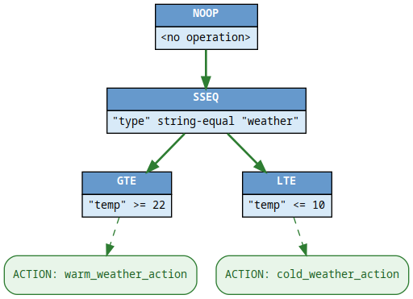

<!-- -*- mode: gfm; auto-fill: t; fill-column: 78; -*- -->
# 📚 DAG Predicate Reference

This document describes the predicates supported by the DAG engine for use in
rule definitions.

These predicates are used to evaluate `Filterable` inputs and decide which
`Action` to invoke during graph traversal.

## 🎯 Operators vs Tokens

The DAG predicate system distinguishes between **operators** and **tokens**.

### Operators

Operators are **used by rule authors** when defining DAG rules. They are
written in YAML or JSON rule specs and specify the logic to apply.

Operators are human-readable strings such as:
 * `==`
 * `string-equal`
 * `in-range-inclusive`

You’ll always use operators when writing rules.

### Tokens

Tokens are internal symbolic identifiers used by the DAG engine. These exist
for internal bookkeeping, debugging, and possibly future bytecode execution.

Example tokens:
 * `EQ` (for `==`)
 * `SSEQ` (for `string-equal`)
 * `REIM` (for `regex-ci-match`)

You don’t need to worry about tokens unless you're hacking the engine
internals.

---

# ✅ Supported Operators

Here’s the full set of predicate operators available for use in DAG rules.

## 🔢 Numeric Comparison

| Operator | Description              |
|----------|--------------------------|
| `==`     | Equal to                 |
| `!=`     | Not equal to             |
| `<`      | Less than                |
| `>`      | Greater than             |
| `<=`     | Less than or equal to    |
| `>=`     | Greater than or equal to |

## 📏 Range Checks

| Operator             | Description                          |
|----------------------|--------------------------------------|
| `in-range-exclusive` | Value is between A and B (exclusive) |
| `in-range-inclusive` | Value is between A and B (inclusive) |

## 🔤 String Comparison

| Operator              | Description                        |
|-----------------------|------------------------------------|
| `string-equal`        | Case-sensitive string equality     |
| `string-ci-equal`     | Case-insensitive string equality   |
| `string-not-equal`    |Case-sensitive string inequality    |
| `string-ci-not-equal` | Case-insensitive string inequality |

## 🧩 String Membership

| Operator              | Description                                  |
|-----------------------|----------------------------------------------|
| `string-member`       | Value is in a string list (case-sensitive)   |
| `string-ci-member`    | Value is in a string list (case-insensitive) |

## 🧪 Regular Expressions

| Operator              | Description                               |
|-----------------------|-------------------------------------------|
| `regex-match`         | Case-sensitive regular expression match   |
| `regex-ci-match`      | Case-insensitive regular expression match |

# 🧿 Internal Tokens

Here’s the internal token equivalents for reference only. Not used in rule
specs.

## Numeric Tokens

| Token | Operator Equivalent  |
|-------|----------------------|
| `EQ`  | `==`                 |
| `NEQ` | `!=`                 |
| `LT`  | `<`                  |
| `GT`  | `>`                  |
| `LTE` | `<=`                 |
| `GTE` | `>=`                 |
| `EIR` | `in-range-exclusive` |
| `IIR` | `in-range-inclusive` |

## String Tokens

| Token   | Operator Equivalent   |
|---------|-----------------------|
| `SSEQ`  | `string-equal`        |
| `SIEQ`  | `string-ci-equal`     |
| `SSNEQ` | `string-not-equal`    |
| `SINEQ` | `string-ci-not-equal` |
| `SSM`   | `string-member`       |
| `SIM`   | `string-ci-member`    |
| `RESM`  | `regex-match`         |
| `REIM`  | `regex-ci-match`      |

## 🚧 Notes

 * Only operators are needed when writing rules.
 * Tokens are only useful if you're extending or embedding the DAG engine.
 * Operators are matched case-insensitively, but best practice is to match
   documented casing.

---

# ⚙️ Built-in Actions

The DAG engine comes with a small set of **built-in actions**, which are
compiled into actual function objects during DAG rule processing.

Each action is defined by its `perform` field and can include a set of
parameters passed via `params`.

> ℹ️ Actions are executed when a rule’s predicate chain evaluates to true.

## ✏️ mutate

The `mutate` action sets a new value on an attribute within the input
structure. This is useful for tagging, annotating, or modifying values
in-flight.

### Parameters

| Name        | Type     | Required | Description                                  |
|-------------|----------|----------|----------------------------------------------|
| `attribute` | `string` | ✅       | The attribute name to set on the input.      |
| `new_value` | `any`    | ✅       | The value to assign to the attribute.        |

### Example

```yaml
perform: "mutate"
params:
  attribute: "temperature_state"
  new_value: "cold"
```

When executed, this action sets the key "temperature_state" on the input to
"cold".

> 🔍 If debug mode is enabled, this action logs its operation using the DAG's
> logger.

## 📢 log

The log action logs a fixed message to the engine’s logger. It's useful for
debugging or for tracking traversal paths.

### Parameters

| Name      | Type     | Required | Description                     |
|-----------|----------|----------|---------------------------------|
| `message` | `string` | ✅       | The message to print to the log |


### Example

``` yaml
perform: "log"
params:
  message: "Node triggered: hot_weather_alert"
```

This will emit a log line at INFO level containing the provided message and
the input's structure.


> 💬 The log includes the source log_action and the full input structure under
> the structure key.

## ➕ Adding More Actions

You can extend the DAG engine by implementing your own `Actions` type and
passing it to `NewCompilerWithPredicates()`.

For example:

``` go
customBuilder := &myCustomActions{}
compiler := dag.NewCompilerWithPredicates(ctx, customBuilder, dag.BuildPredicateDict())
```

Built-in actions are compiled via the `Actions.Builder(funame string, params
ActionParams)` interface. The function name is normalised to lowercase before
dispatch.

If an unknown action is referenced, rule compilation will fail with
`ErrUnknownBuiltin`.

---

# 💡 Examples

Consider the following events:

``` json
{ "type": "weather", "temp": 8  }
{ "type": "weather", "temp": 27 }
{ "type": "weather", "temp": 19 }
```

We can define rules that will inform us whether it's cold or it's warm.

We want two rules:
 * Temperature 22 degrees or higher? Then it's warm!
 * Temperature 10 degrees or lower? Then it's cold.

We do that by defining two rules: `warm_weather` and `cold_weather`.

We then chain conditions together to match when `type` is "weather" and
when `temp` matches a given numeric condition.

For now we wish to keep things simple, so we only log when the condition
matches.

What follows are rules for the above, represented in both YAML and JSON.

## YAML

``` yaml
- name: warm_weather
  conditions:
    - attribute: type
      operator: string-equal
      value: weather
    - attribute: temp
      operator: '>='
      value: 22
  action:
    name: warm_weather_action
    perform: log
    params:
      message: It's warm!

- name: cold_weather
  conditions:
    - attribute: type
      operator: string-equal
      value: weather
    - attribute: temp
      operator: '<='
      value: 10
  action:
    name: cold_weather_action
    perform: log
    params:
      message: It's cold!
```

## JSON

``` json
[
    {
        "name": "warm_weather",
        "conditions": [
            {
                "attribute": "type",
                "operator":  "string-equal",
                "value":     "weather"
            }, {
                "attribute": "temp",
                "operator":  ">=",
                "value":     22
            }
        ],
        "action": {
            "name":    "warm_weather_action",
            "perform": "log",
            "params": {
                "message": "It's warm!"
            }
        }
    }, {
        "name": "cold_weather",
        "conditions": [
            {
                "attribute": "type",
                "operator":  "string-equal",
                "value":     "weather"
            }, {
                "attribute": "temp",
                "operator":  "<=",
                "value":     10
            }
        ],
        "action": {
            "name":    "cold_weather_action",
            "perform": "log",
            "params": {
                "message": "It's cold!"
            }
        }
    }
]
```

## Visualisation



---

# 🧠 Design Goals

 * Declarative, readable, and human-friendly.
 * Extensible predicate engine via `PredicateDict`.
 * Safe and strict predicate evaluation.
 * Designed for low-alloc, high-throughput DAG traversal.

---

# 🧑‍ See Also

 * [dag/compiler.go](dag/compiler.go)
 * [dag/predicates.go](dag/predicates.go)
 * [dag/actions.go](dag/actions.go)
 * [../go/dag.md](../go/dag.md)
