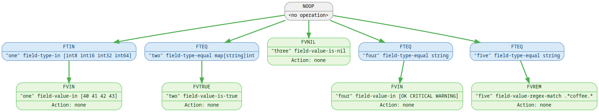

<!-- -*- mode: gfm; auto-fill: t; fill-column: 78; -*- -->
# 📚 Validator Predicate Reference

This document describes the predicates supported by the `validator` package.
These predicates can be used with DAG-style rule evaluation engines and are
designed to operate on Go structs via reflection and dynamic field access.

## 🧠 Predicate Structure

Each predicate operates on a specific field within an input structure.
Predicates are structured as:

```yaml
field: "temperature"
predicate: "field-value-<"
value: 25
```

The `predicate` is a symbolic operator used to evaluate the value of a field.

### 🧩 Field vs Value Predicates

- **Field Type Predicates**: Operate on the Go type of a struct field.
- **Field Value Predicates**: Operate on the runtime value of a struct field.

---

# ✅ Supported Predicates

## 🏷 Field Type Predicates

These predicates inspect the *declared type* of a field.

### `FTEQ` — Field Type Equals

**Token:** `field-type-equal`
**Description:** Returns true if the field's Go type name matches the given
string.

**Example:**

```yaml
field: "status"
predicate: "field-type-equal"
value: "string"
```

### `FTIN` — Field Type In

**Token:** `field-type-in`
**Description:** Returns true if the field's type is in the list of accepted
types.

**Example:**

```yaml
field: "payload"
predicate: "field-type-in"
value: ["map[string]any", "[]byte"]
```

## 🔢 Field Value Predicates

These compare the *runtime value* of a field.

### `FVEQ` — Field Value Equals

**Token:** `field-value-equal`
**Description:** Returns true if the value equals the expected value. Supports
`int`, `float`, `complex`, `string`, `bool`.

### `FVNEQ` — Field Value Not Equal

**Token:** `field-value-not-equal`
**Description:** Logical inverse of `FVEQ`. Returns true if values differ.

### `FVLT` — Field Value Less Than

**Token:** `field-value-<`
**Description:** Field's value is less than the predicate's value.

### `FVLTE` — Field Value Less Than or Equal

**Token:** `field-value-<=`
**Description:** Field's value is less than or equal to the predicate's value.

### `FVGT` — Field Value Greater Than

**Token:** `field-value->`
**Description:** Field's value is greater than the predicate's value.

### `FVGTE` — Field Value Greater Than or Equal

**Token:** `field-value->=`
**Description:** Field's value is greater than or equal to the predicate's value.

### `FVIN` — Field Value In

**Token:** `field-value-in`
**Description:** Returns true if the value is present in the provided list.

**Example:**

```yaml
field: "mode"
predicate: "field-value-in"
value: ["safe", "dry_run", "check"]
```

## 🔍 String / Regex Predicates

### `FVREM` — Field Value Regex Match

**Token:** `field-value-regex-match`
**Description:** Returns true if the string value matches the provided regex.

**Example:**

```yaml
field: "email"
predicate: "field-value-regex-match"
value: "^[a-z0-9._%+-]+@example\.com$"
```

## ⚖ Logical Predicates

### `FVTRUE` — Field Value Is Logically True

**Token:** `field-value-is-true`
**Description:** Returns true if the field's value is non-zero/non-empty.

Structures are **never** considered logically true.

### `FVFALSE` — Field Value Is Logically False

**Token:** `field-value-is-false`
**Description:** Returns true if the value is zero, empty, or `false`.
Equivalent to Go’s `reflect.Value.IsZero()` in most cases.

### `FVNIL` — Field Value Is Nil

**Token:** `field-value-is-nil`
**Description:** Returns true only if the field’s reference value is `nil`.
This does not match zero values like empty strings or zero numbers.

---

# 💡 Examples

Let's consider the following Go structure:

``` go
    type DummyStructure struct {
        One   any            `json:"one"`
        Two   map[string]int `json:"name_to_id"`
        Three any
        Four  string
        Five  string
    }
```

Let's say we have the following contrived constraints:

 * Field `One` must be:
   * of type `int64`
   * a value of `40`, `41`, `42`, `43`
 * Field `Two` must be:
   * of type `map[string]int`
   * logically true -- that is, not zero or empty.
 * Field `Three` must be:
   * `nil`
 * Field `Four` must be:
   * of type `string`
   * a value of `OK`, `CRITICAL`, `WARNING`
 * Field `Five` must be:
   * of type `string`
   * match the regular expression `.*coffee.*`

We can define the YAML rules thusly:

``` yaml

- name: "'One' must be int64 and between 40-43"
  conditions:
    - attribute: one
      operator: field-type-in
      value: [int8, int16, int32, int64]
    - attribute: one
      operator: field-value-in
      value: [40, 41, 42, 43]
  action:
    perform: ignore

- name: "'Two' must be map[string]int and not empty"
  conditions:
    - attribute: two
      operator: field-type-equal
      value: map[string]int
    - attribute: two
      operator: field-value-is-true
  action:
    perform: ignore

- name: "'three' must be nil"
  conditions:
    - attribute: three
      operator: field-value-is-nil
  action:
    perform: ignore

- name: "'four' must be string and member"
  conditions:
    - attribute: four
      operator: field-type-equal
      value: string
    - attribute: four
      operator: field-value-in
      value: [OK, CRITICAL, WARNING]
  action:
    perform: ignore

- name: "'five' must match regex"
  conditions:
    - attribute: five
      operator: field-type-equal
      value: string
    - attribute: five
      operator: field-value-regex-match
      value: ".*coffee.*"
  action:
    perform: ignore
```

In this case, I am using the special action `ignore` that is only available
inside the unit tests, but for production rules you would want to use one of
the predefined actions available to the validator.

## Visualisation



---

# 📌 Notes

- `FVEQ`/`FVNEQ` support cross-type comparisons (e.g. comparing `int64` to
  `int`), with width checks.
- `FVNIL` and `FVFALSE` are **not** the same — nil is reference-level, false is
  logical.
- Struct fields are never `FVFALSE` or `FVTRUE` — those require recursive
  validation.

---

# 🧑 See Also

 * [dag/manual.md](dag/manual.md)
 * [validator/predicates.go](../../validator/predicates.go)
 * [validator/README.md](../../validator/README.md)
